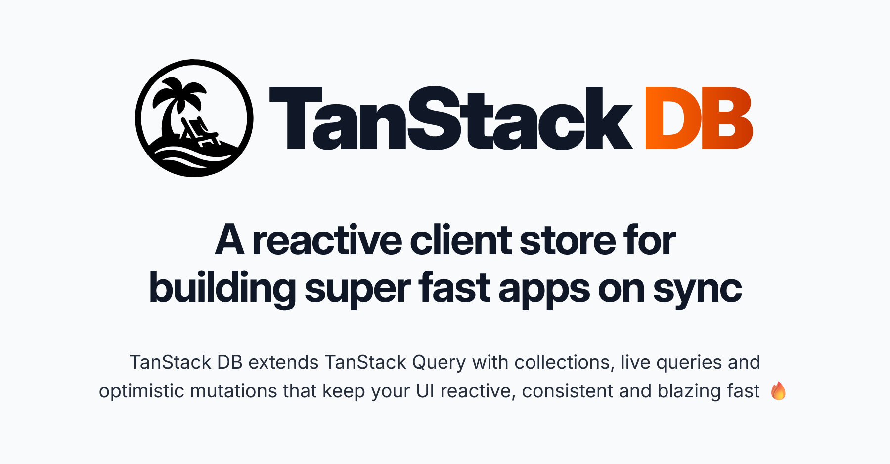

  

> Tanstack DB is currently in BETA. See [the release post](https://tanstack.com/blog/tanstack-db-0.1-the-embedded-client-database-for-tanstack-query) for more details.

A backend‑agnostic, real‑time data layer that powers live queries, local writes, and fine‑grained reactivity for complex apps.

- Blazing‑fast query engine for sub‑millisecond live queries, joins & aggregates  
- Fine‑grained reactivity to minimize component re‑rendering  
- Robust transaction primitives for optimistic mutations with sync & lifecycle support  
- Normalized data model that keeps backends simple and consistent

<a href="https://tanstack.com/db" style="font-weight:bold" >Read the DB docs →</a>
 

	
	
	

	
	
	

		
  [Become a Sponsor!](https://github.com/sponsors/tannerlinsley/)

## Get Involved

- We welcome issues and pull requests!
- Participate in [GitHub discussions](https://github.com/TanStack/<library>/discussions)
- Chat with the community on [Discord](https://discord.com/invite/WrRKjPJ)
- See [CONTRIBUTING.md](./CONTRIBUTING.md) for setup instructions

## Partners

  
  

  

    
      DB
      <svg stroke="currentColor" fill="none" stroke-width="2" viewBox="0 0 24 24" stroke-linecap="round" stroke-linejoin="round" height="1em" width="1em" xmlns="http://www.w3.org/2000/svg"><path d="M19.5 12.572l-7.5 7.428l-7.5 -7.428a5 5 0 1 1 7.5 -6.566a5 5 0 1 1 7.5 6.572"></path><path d="M12 6l-3.293 3.293a1 1 0 0 0 0 1.414l.543 .543c.69 .69 1.81 .69 2.5 0l1 -1a3.182 3.182 0 0 1 4.5 0l2.25 2.25"></path><path d="M12.5 15.5l2 2"></path><path d="M15 13l2 2"></path></svg>
      You?
    
    

      We're looking for TanStack DB Partners to join our mission! Partner with us to push the boundaries of TanStack DB and build amazing things together.
    

    <a href="mailto:partners@tanstack.com?subject=TanStack DB Partnership" style="text-transform: uppercase; font-weight: bold;">Let's chat</a>
  

## Explore the TanStack Ecosystem

	<a href="https://github.com/tanstack/config" style="font-weight: bold;">TanStack Config</a> – Tooling for JS/TS packages
	 
	<a href="https://github.com/tanstack/devtools" style="font-weight: bold;">TanStack DevTools</a> – Unified devtools panel
	 
	<a href="https://github.com/tanstack/form" style="font-weight: bold;">TanStack Form</a> – Type‑safe form state
	 
	<a href="https://github.com/tanstack/pacer" style="font-weight: bold;">TanStack Pacer</a> – Debouncing, throttling, batching
	 
	<a href="https://github.com/tanstack/query" style="font-weight: bold;">TanStack Query</a> – Async state & caching
	 
	<a href="https://github.com/tanstack/ranger" style="font-weight: bold;">TanStack Ranger</a> – Range & slider primitives
	 
	<a href="https://github.com/tanstack/router" style="font-weight: bold;">TanStack Router</a> –  Type‑safe routing, caching & URL state
	 
	<a href="https://github.com/tanstack/router" style="font-weight: bold;">TanStack Start</a> –  Full‑stack SSR & streaming
	 
	<a href="https://github.com/tanstack/store" style="font-weight: bold;">TanStack Store</a> – Reactive data store
	 
	<a href="https://github.com/tanstack/table" style="font-weight: bold;">TanStack Table</a> – Headless datagrids
	 
	<a href="https://github.com/tanstack/virtual" style="font-weight: bold;">TanStack Virtual</a> – Virtualized rendering
	 
  … and more at <a href="https://tanstack.com" style="font-weight: bold;">TanStack.com »</a>
</di
v>

<!-- Use the force, Luke -->
