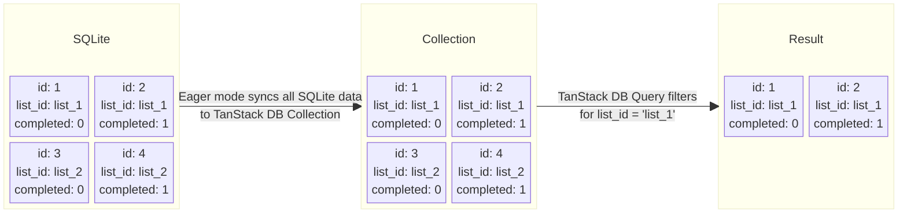
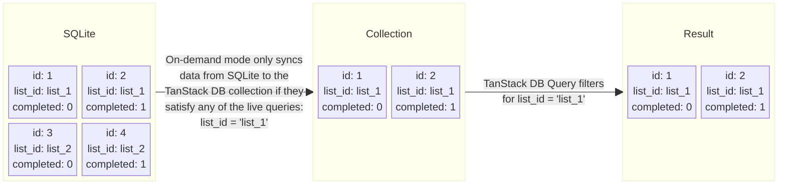
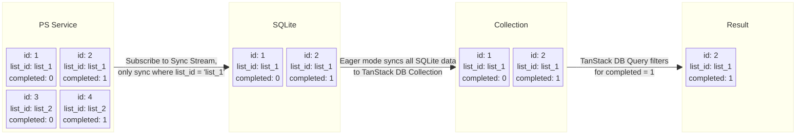
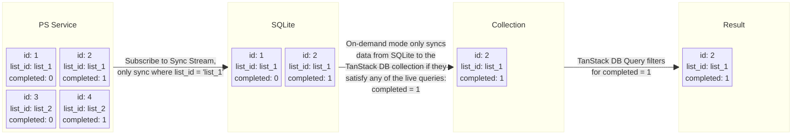
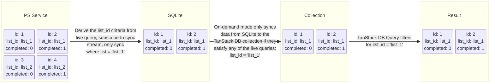
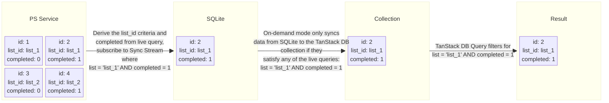

# PowerSync Collection

PowerSync collections provide seamless integration between TanStack DB and [PowerSync](https://powersync.com), enabling automatic synchronization between your in-memory TanStack DB collections and PowerSync's SQLite database. This gives you offline-ready persistence, real-time sync capabilities, and powerful conflict resolution.

## Overview

The `@tanstack/powersync-db-collection` package allows you to create collections that:

- Automatically mirror the state of an underlying PowerSync SQLite database
- Reactively update when PowerSync records change
- Support optimistic mutations with rollback on error
- Provide persistence handlers to keep PowerSync in sync with TanStack DB transactions
- Use PowerSync's efficient SQLite-based storage engine
- Work with PowerSync's real-time sync features for offline-first scenarios
- Leverage PowerSync's built-in conflict resolution and data consistency guarantees
- Enable real-time synchronization with PostgreSQL, MongoDB and MySQL backends

## 1. Installation

Install the PowerSync collection package along with your preferred framework integration.
PowerSync currently works with Web, React Native and Node.js. The examples below use the Web SDK.
See the PowerSync quickstart [docs](https://docs.powersync.com/installation/quickstart-guide) for more details.

```bash
npm install @tanstack/powersync-db-collection @powersync/web @journeyapps/wa-sqlite
```

### 2. Create a PowerSync Database and Schema

```ts
import { Schema, Table, column } from "@powersync/web"

// Define your schema
const APP_SCHEMA = new Schema({
  documents: new Table({
    name: column.text,
    author: column.text,
    created_at: column.text,
    archived: column.integer,
  }),
})

// Initialize PowerSync database
const db = new PowerSyncDatabase({
  database: {
    dbFilename: "app.sqlite",
  },
  schema: APP_SCHEMA,
})
```

### 3. (optional) Configure Sync with a Backend

```ts
import {
  AbstractPowerSyncDatabase,
  PowerSyncBackendConnector,
  PowerSyncCredentials,
} from "@powersync/web"

// TODO implement your logic here
class Connector implements PowerSyncBackendConnector {
  fetchCredentials: () => Promise<PowerSyncCredentials | null>

  /** Upload local changes to the app backend.
   *
   * Use {@link AbstractPowerSyncDatabase.getCrudBatch} to get a batch of changes to upload.
   *
   * Any thrown errors will result in a retry after the configured wait period (default: 5 seconds).
   */
  uploadData: (database: AbstractPowerSyncDatabase) => Promise<void>
}

// Configure the client to connect to a PowerSync service and your backend
db.connect(new Connector())
```

### 4. Create a TanStack DB Collection

There are two main ways to create a collection: using type inference or using schema validation. Type inference will infer collection types from the underlying PowerSync SQLite tables. Schema validation can be used for additional input/output validations and type transforms.

#### Option 1: Using Table Type Inference

The collection types are automatically inferred from the PowerSync schema table definition. The table is used to construct a default standard schema validator which is used internally to validate collection operations.

Collection mutations accept SQLite types and queries report data with SQLite types.

```ts
import { createCollection } from "@tanstack/react-db"
import { powerSyncCollectionOptions } from "@tanstack/powersync-db-collection"

const documentsCollection = createCollection(
  powerSyncCollectionOptions({
    database: db,
    table: APP_SCHEMA.props.documents,
  })
)

/** Note: The types for input and output are defined as this */
// Used for mutations like `insert` or `update`
type DocumentCollectionInput = {
  id: string
  name: string | null
  author: string | null
  created_at: string | null // SQLite TEXT
  archived: number | null // SQLite integer
}
// The type of query/data results
type DocumentCollectionOutput = DocumentCollectionInput
```

The standard PowerSync SQLite types map to these TypeScript types:

| PowerSync Column Type | TypeScript Type  | Description                                                          |
| --------------------- | ---------------- | -------------------------------------------------------------------- |
| `column.text`         | `string \| null` | Text values, commonly used for strings, JSON, dates (as ISO strings) |
| `column.integer`      | `number \| null` | Integer values, also used for booleans (0/1)                         |
| `column.real`         | `number \| null` | Floating point numbers                                               |

Note: All PowerSync column types are nullable by default.

#### Option 2: SQLite Types with Schema Validation

Additional validations for collection mutations can be performed with a custom schema. The Schema below asserts that
the `name`, `author` and `created_at` fields are required as input. `name` also has an additional string length check.

Note: The input and output types specified in this example still satisfy the underlying SQLite types. An additional `deserializationSchema` is required if the typing differs. See the examples below for more details.

The application logic (including the backend) should enforce that all incoming synced data passes validation with the `schema`. Failing to validate data will result in inconsistency of the collection data. This is a fatal error! An `onDeserializationError` handler must be provided to react to this case.

```ts
import { createCollection } from "@tanstack/react-db"
import { powerSyncCollectionOptions } from "@tanstack/powersync-db-collection"
import { z } from "zod"

// Schema validates SQLite types but adds constraints
const schema = z.object({
  id: z.string(),
  name: z.string().min(3, { message: "Should be at least 3 characters" }),
  author: z.string(),
  created_at: z.string(), // SQLite TEXT for dates
  archived: z.number(),
})

const documentsCollection = createCollection(
  powerSyncCollectionOptions({
    database: db,
    table: APP_SCHEMA.props.documents,
    schema,
    onDeserializationError: (error) => {
      // Present fatal error
    },
  })
)

/** Note: The types for input and output are defined as this */
// Used for mutations like `insert` or `update`
type DocumentCollectionInput = {
  id: string
  name: string
  author: string
  created_at: string // SQLite TEXT
  archived: number // SQLite integer
}
// The type of query/data results
type DocumentCollectionOutput = DocumentCollectionInput
```

#### Option 3: Transform SQLite Input Types to Rich Output Types

You can transform SQLite types to richer types (like Date objects) while keeping SQLite-compatible input types:

Note: The Transformed types are provided by TanStack DB to the PowerSync SQLite persister. These types need to be serialized in
order to be persisted to SQLite. Most types are converted by default. For custom types, override the serialization by providing a
`serializer` param.

The example below uses `nullable` columns, this is not a requirement.

The application logic (including the backend) should enforce that all incoming synced data passes validation with the `schema`. Failing to validate data will result in inconsistency of the collection data. This is a fatal error! An `onDeserializationError` handler must be provided to react to this case.

```ts
const schema = z.object({
  id: z.string(),
  name: z.string().nullable(),
  created_at: z
    .string()
    .nullable()
    .transform((val) => (val ? new Date(val) : null)), // Transform SQLite TEXT to Date
  archived: z
    .number()
    .nullable()
    .transform((val) => (val != null ? val > 0 : null)), // Transform SQLite INTEGER to boolean
})

const documentsCollection = createCollection(
  powerSyncCollectionOptions({
    database: db,
    table: APP_SCHEMA.props.documents,
    schema,
    onDeserializationError: (error) => {
      // Present fatal error
    },
    // Optional: custom column serialization
    serializer: {
      // Dates are serialized by default, this is just an example
      created_at: (value) => (value ? value.toISOString() : null),
    },
  })
)

/** Note: The types for input and output are defined as this */
// Used for mutations like `insert` or `update`
type DocumentCollectionInput = {
  id: string
  name: string | null
  author: string | null
  created_at: string | null // SQLite TEXT
  archived: number | null
}
// The type of query/data results
type DocumentCollectionOutput = {
  id: string
  name: string | null
  author: string | null
  created_at: Date | null // JS Date instance
  archived: boolean | null // JS boolean
}
```

#### Option 4: Custom Input/Output Types with Deserialization

The input and output types can be completely decoupled from the internal SQLite types. This can be used to accept rich values for input mutations.
We require an additional `deserializationSchema` in order to validate and transform incoming synced (SQLite) updates. This schema should convert the incoming SQLite update to the output type.

The application logic (including the backend) should enforce that all incoming synced data passes validation with the `deserializationSchema`. Failing to validate data will result in inconsistency of the collection data. This is a fatal error! An `onDeserializationError` handler must be provided to react to this case.

```ts
// Our input/output types use Date and boolean
const schema = z.object({
  id: z.string(),
  name: z.string(),
  author: z.string(),
  created_at: z.date(), // Accept Date objects as input
  archived: z.boolean(), // Accept Booleans as input
})

// Schema to transform from SQLite types to our output types
const deserializationSchema = z.object({
  id: z.string(),
  name: z.string(),
  author: z.string(),
  created_at: z
    .string()
    .transform((val) => (new Date(val))), // SQLite TEXT to Date
  archived: z
    .number()
    .transform((val) => (val > 0), // SQLite INTEGER to Boolean
})

const documentsCollection = createCollection(
  powerSyncCollectionOptions({
    database: db,
    table: APP_SCHEMA.props.documents,
    schema,
    deserializationSchema,
    onDeserializationError: (error) => {
      // Present fatal error
    },
  })
)

/** Note: The types for input and output are defined as this */
// Used for mutations like `insert` or `update`
type DocumentCollectionInput = {
  id: string
  name: string
  author: string
  created_at: Date
  archived: boolean
}
// The type of query/data results
type DocumentCollectionOutput = DocumentCollectionInput
```

## Features

### Offline-First

PowerSync collections are offline-first by default. All data is stored locally in a SQLite database, allowing your app to work without an internet connection. Changes are automatically synced when connectivity is restored.

### Real-Time Sync

When connected to a PowerSync backend, changes are automatically synchronized in real-time across all connected clients. The sync process handles:

- Bi-directional sync with the server
- Conflict resolution
- Queue management for offline changes
- Automatic retries on connection loss

### Working with Rich JavaScript Types

PowerSync collections support rich JavaScript types like `Date`, `Boolean`, and custom objects while maintaining SQLite compatibility. The collection handles serialization and deserialization automatically:

```typescript
import { z } from "zod"
import { Schema, Table, column } from "@powersync/web"
import { createCollection } from "@tanstack/react-db"
import { powerSyncCollectionOptions } from "@tanstack/powersync-db-collection"

// Define PowerSync SQLite schema
const APP_SCHEMA = new Schema({
  tasks: new Table({
    title: column.text,
    due_date: column.text, // Stored as ISO string in SQLite
    completed: column.integer, // Stored as 0/1 in SQLite
    metadata: column.text, // Stored as JSON string in SQLite
  }),
})

// Define rich types schema
const taskSchema = z.object({
  id: z.string(),
  title: z.string().nullable(),
  due_date: z
    .string()
    .nullable()
    .transform((val) => (val ? new Date(val) : null)), // Convert to Date
  completed: z
    .number()
    .nullable()
    .transform((val) => (val != null ? val > 0 : null)), // Convert to boolean
  metadata: z
    .string()
    .nullable()
    .transform((val) => (val ? JSON.parse(val) : null)), // Parse JSON
})

// Create collection with rich types
const tasksCollection = createCollection(
  powerSyncCollectionOptions({
    database: db,
    table: APP_SCHEMA.props.tasks,
    schema: taskSchema,
  })
)

// Work with rich types in your code
await tasksCollection.insert({
  id: crypto.randomUUID(),
  title: "Review PR",
  due_date: "2025-10-30T10:00:00Z", // String input is automatically converted to Date
  completed: 0, // Number input is automatically converted to boolean
  metadata: JSON.stringify({ priority: "high" }),
})

// Query returns rich types
const task = tasksCollection.get("task-1")
console.log(task.due_date instanceof Date) // true
console.log(typeof task.completed) // "boolean"
console.log(task.metadata.priority) // "high"
```

### Type Safety with Rich Types

The collection maintains type safety throughout:

```typescript
type TaskInput = {
  id: string
  title: string | null
  due_date: string | null // Accept ISO string for mutations
  completed: number | null // Accept 0/1 for mutations
  metadata: string | null // Accept JSON string for mutations
}

type TaskOutput = {
  id: string
  title: string | null
  due_date: Date | null // Get Date object in queries
  completed: boolean | null // Get boolean in queries
  metadata: {
    priority: string
    [key: string]: any
  } | null
}

// TypeScript enforces correct types:
tasksCollection.insert({
  due_date: new Date(), // Error: Type 'Date' is not assignable to type 'string'
})

const task = tasksCollection.get("task-1")
task.due_date.getTime() // OK - TypeScript knows this is a Date
```

### Optimistic Updates

Updates to the collection are applied optimistically to the local state first, then synchronized with PowerSync and the backend. If an error occurs during sync, the changes are automatically rolled back.

### Metadata Tracking

Metadata tracking allows attaching custom metadata to collection operations (insert, update, delete). This metadata is persisted alongside the operation and available in PowerSync `CrudEntry` records during upload processing. This is useful for passing additional context about mutations to the backend, such as audit information, operation sources, or custom processing hints.

#### Enabling Metadata Tracking

Metadata tracking must be enabled on the PowerSync table:

```typescript
const APP_SCHEMA = new Schema({
  documents: new Table(
    {
      name: column.text,
      author: column.text,
    },
    {
      // Enable metadata tracking on this table
      trackMetadata: true,
    }
  ),
})
```

#### Using Metadata in Operations

Once enabled, metadata can be passed to any collection operation:

```typescript
const documents = createCollection(
  powerSyncCollectionOptions({
    database: db,
    table: APP_SCHEMA.props.documents,
  })
)

// Insert with metadata
await documents.insert(
  {
    id: crypto.randomUUID(),
    name: "Report Q4",
    author: "Jane Smith",
  },
  {
    metadata: {
      source: "web-app",
      userId: "user-123",
      timestamp: Date.now(),
    },
  }
).isPersisted.promise

// Update with metadata
await documents.update(
  docId,
  { metadata: { reason: "typo-fix", editor: "user-456" } },
  (doc) => {
    doc.name = "Report Q4 (Updated)"
  }
).isPersisted.promise

// Delete with metadata
await documents.delete(docId, {
  metadata: { deletedBy: "user-789", reason: "duplicate" },
}).isPersisted.promise
```

#### Accessing Metadata During Upload

The metadata is available in PowerSync `CrudEntry` records when processing uploads in the connector:

```typescript
import { CrudEntry } from "@powersync/web"

class Connector implements PowerSyncBackendConnector {
  // ...

  async uploadData(database: AbstractPowerSyncDatabase) {
    const batch = await database.getCrudBatch()
    if (!batch) return

    for (const entry of batch.crud) {
      console.log("Operation:", entry.op) // PUT, PATCH, DELETE
      console.log("Table:", entry.table)
      console.log("Data:", entry.opData)
      console.log("Metadata:", entry.metadata) // Custom metadata (stringified)

      // Parse metadata if needed
      if (entry.metadata) {
        const meta = JSON.parse(entry.metadata)
        console.log("Source:", meta.source)
        console.log("User ID:", meta.userId)
      }

      // Process the operation with the backend...
    }

    await batch.complete()
  }
}
```

**Note**: If metadata is provided to an operation but the table doesn't have `trackMetadata: true`, a warning will be logged and the metadata will be ignored.

## Configuration Options

The `powerSyncCollectionOptions` function accepts the following options:

```ts
interface PowerSyncCollectionConfig<TTable extends Table, TSchema> {
  // Required options
  database: PowerSyncDatabase
  table: Table

  // Schema validation and type transformation
  schema?: StandardSchemaV1
  deserializationSchema?: StandardSchemaV1 // Required for custom input types
  onDeserializationError?: (error: StandardSchemaV1.FailureResult) => void // Required for custom input types

  // Optional Custom serialization
  serializer?: {
    [Key in keyof TOutput]?: (value: TOutput[Key]) => SQLiteCompatibleType
  }

  // Performance tuning
  syncBatchSize?: number // Control batch size for initial sync, defaults to 1000
}
```

## Advanced Transactions

When you need more control over transaction handling, such as batching multiple operations or handling complex transaction scenarios, you can use PowerSync's transaction system directly with TanStack DB transactions.

```ts
import { createTransaction } from "@tanstack/react-db"
import { PowerSyncTransactor } from "@tanstack/powersync-db-collection"

// Create a transaction that won't auto-commit
const batchTx = createTransaction({
  autoCommit: false,
  mutationFn: async ({ transaction }) => {
    // Use PowerSyncTransactor to apply the transaction to PowerSync
    await new PowerSyncTransactor({ database: db }).applyTransaction(
      transaction
    )
  },
})

// Perform multiple operations in the transaction
batchTx.mutate(() => {
  // Add multiple documents in a single transaction
  for (let i = 0; i < 5; i++) {
    documentsCollection.insert({
      id: crypto.randomUUID(),
      name: `Document ${i}`,
      content: `Content ${i}`,
      created_at: new Date().toISOString(),
      updated_at: new Date().toISOString(),
    })
  }
})

// Commit the transaction
await batchTx.commit()

// Wait for the changes to be persisted
await batchTx.isPersisted.promise
```

This approach allows you to:

- Batch multiple operations into a single transaction
- Control when the transaction is committed
- Ensure all operations are atomic
- Wait for persistence confirmation
- Handle complex transaction scenarios

## On-demand Sync Mode (Query Driven Sync)

By default the PowerSync collection uses the `eager` sync mode, but you can opt to use `on-demand` sync mode instead. In on-demand mode, the collection is query-driven - it only loads data from SQLite that satisfies the predicates of your active live queries, rather than syncing everything and filtering afterwards.

To understand how data flows under the hood, it helps to know that there are two independent dimensions at play:

- **Sync mode** (`eager` vs `on-demand`) - controls how data moves from SQLite into the TanStack DB collection
- **Sync Streams** (optional) - controls how data moves from the PowerSync Service into SQLite, using the `onLoad` or `onLoadSubset` hooks

These dimensions compose independently, giving you six combinations covered below:

| Example | Sync mode | Sync Streams | Parameters |
|---|---|---|---|
| 1 | Eager | No | - |
| 2 | On-demand | No | - |
| 3 | Eager | Yes | Hardcoded |
| 4 | On-demand | Yes | Hardcoded |
| 5 | On-demand | Yes | Dynamic - `extractSimpleComparisons` |
| 6 | On-demand | Yes | Dynamic - `parseWhereExpression` |

Examples 1 and 2 assume SQLite is already fully populated by PowerSync's sync mechanism. Examples 3–6 add Sync Streams, which let you control which data from the PowerSync Service reaches SQLite in the first place - useful when you only want a subset of data on-device.

In examples 3 and 4, Sync Stream subscription parameters are hardcoded. Examples 5 and 6 show how to derive those parameters dynamically from the live query's predicates, so the subscription automatically adjusts as the query changes.


### 1. Eager Mode

In `eager` mode, all data from the SQLite database is synced into the TanStack DB collection. The live query then filters this full dataset to produce the final result. This means the collection holds all rows regardless of whether they match any active query.



```typescript
const collection = createCollection(
  powerSyncCollectionOptions({
    database: db,
    table: AppSchema.props.todos,
    syncMode: 'eager'
  }),
)

const liveQuery = createLiveQueryCollection({
  query: (q) =>
    q
      .from({ todo: collection })
      .where(
        ({ todo }) => eq(todo.list_id, 'list_id'),
      )
      .select(({ todo }) => ({
        id: todo.id,
        completed: todo.completed,
      })),
})
```

### 2. On-Demand Mode

In `on-demand` mode, only data from the SQLite database that satisfies the predicates of active TanStack DB live queries is synced into the TanStack DB collection. This reduces the amount of data held in memory, since the collection only contains rows that are relevant to the queries currently registered against it.



```typescript
const collection = createCollection(
  powerSyncCollectionOptions({
    database: db,
    table: AppSchema.props.todos,
    syncMode: 'on-demand'
  }),
)

// live query that tells the collection what the data domain is
const liveQuery = createLiveQueryCollection({
  query: (q) =>
    q
      .from({ todo: collection })
      .where(
        ({ todo }) => eq(todo.list_id, 'list_id'),
      )
      .select(({ todo }) => ({
        id: todo.id,
        completed: todo.completed,
      })),
})
```

## Incorporating Sync Streams With OnLoad/OnLoadSubset Hooks
Sync Streams can be used through the data loading hooks for both `eager` and `on-demand` sync modes that allow a user to call Sync Streams when a collection is defined (eager mode) or when a collection's data boundary changes based on the live queries predicates (on-demand).

These examples assume the following Sync Stream definition exists:
```
config:
  edition: 3

streams:
  lists:
    query: SELECT * FROM lists WHERE owner_id = auth.user_id()
    auto_subscribe: true
  todos:
    query: SELECT * FROM todos WHERE list_id = subscription.parameter('list') AND list_id IN (SELECT id FROM lists WHERE owner_id = auth.user_id())
```

### 3. Eager Mode with Sync Streams

Use the `onLoad` hook to subscribe to a Sync Stream when the collection first loads, so SQLite is populated before the collection starts serving queries. In `eager` mode, all rows in SQLite are synced into the TanStack DB collection; live query filtering then runs against that full dataset. 
The hook can optionally return a cleanup function where you can unsubscribe from the Sync Stream.

This example starts with 4 todos in the PowerSync Service, only 2 of which get synced via the Sync Stream to the SQLite database. Because it's eager mode, both get synced from the SQLite database to the collection. Finally the TanStack DB query only returns the single todo that matches the live query predicate.



```typescript
const collection = createCollection(
  powerSyncCollectionOptions({
    database: db,
    table: AppSchema.props.todos,
    syncMode: 'eager',
    onLoad: async () => {
      console.log('onLoad')
      const subscription = await db
        .syncStream('todos', { list: 'list_1' })
        .subscribe()

      await subscription.waitForFirstSync()

      return () => {
        console.log('onUnload')
        subscription.unsubscribe()
      }
    },
  }),
) 

// A live query that filters by the `completed` state.
const liveQuery = createLiveQueryCollection({
  query: (q) =>
    q
      .from({ todo: collection })
      .where(({ todo }) => eq(todo.completed, 1))
      .select(({ todo }) => ({
        id: todo.id,
        completed: todo.completed,
      })),
})
```

### 4. On-Demand Mode with Sync Streams

Use the `onLoadSubset` hook to subscribe to a Sync Stream whenever the collection's data boundary changes (i.e. when the set of active live queries changes). In `on-demand` mode, only rows that satisfy the active live query predicates are synced from SQLite into the TanStack DB collection. 
The hook can optionally return a cleanup function where you can unsubscribe from the Sync Stream when that subset is no longer needed.

This example starts with 4 todos in the PowerSync Service, only 2 of which get synced via the Sync Stream to the SQLite database. Because it's on-demand mode, only 1 todo matches gets synced from the SQLite database to the collection. Finally the TanStack DB query only returns the single todo that matches the live query predicate.



```typescript
const collection = createCollection(
  powerSyncCollectionOptions({
    database: db,
    table: AppSchema.props.todos,
    syncMode: 'on-demand',
    onLoadSubset: async (options) => {
      console.log('onLoadSubset')
      const subscription = await db
        .syncStream('todos', { list: 'list_1' })
        .subscribe()

      await subscription.waitForFirstSync()

      return () => {
        console.log('onUnloadSubset')
        subscription.unsubscribe()
      }
    },
  }),
)

// A live query that filters by the `completed` state.
const liveQuery = createLiveQueryCollection({
  query: (q) =>
    q
      .from({ todo: collection })
      .where(({ todo }) => eq(todo.completed, 1))
      .select(({ todo }) => ({
        id: todo.id,
        completed: todo.completed,
      })),
})
```

### 5. On-Demand Mode with Simple Predicates

In the previous example, the Sync Stream subscription parameters were hardcoded. In practice, you'll often want to derive those parameters dynamically from the live query's where clause. That way, changing the query automatically adjusts which data is synced from the PowerSync Service. `extractSimpleComparisons` is a convenience helper that parses the expression tree from `onLoadSubset` into a flat list of `{ field, operator, value }` objects. 

Given a live query like:

```
.where(({ todo }) => eq(todo.list_id, selectedListId))
```

`onLoadSubset` receives options.where as an expression tree `for eq(list_id, '<uuid>')`.
The `list_id` value is parsed from the expression tree and passed to `syncStream()`.

Note: This example slightly differs from the previous two as it aims to illustrate `extractSimpleComparisons` usage.

This example starts with 4 todos in the PowerSync Service, the Sync Stream subscription criteria (`list_id = "list_1"`) is derived from the live query registered against the collection. Only 2 todos get synced via the Sync Stream to the SQLite database. Two todos get synced from the SQLite database to the collection. Finally the TanStack DB query returns both todos as they both match `eq(todo.list_id, 'list_id')`.



```typescript
const collection = createCollection(
  powerSyncCollectionOptions({
    database: db,
    table: AppSchema.props.todos,
    syncMode: 'on-demand',
    onLoadSubset: async (options) => {
      // Extract simple comparisons from the where expression
      const comparisons = extractSimpleComparisons(options.where)
      // comparisons = [{ field: ['todo', 'list_id'], operator: 'eq', value: '<uuid>' }]

      // Find the list_id filter
      const listIdFilter = comparisons.find(
        (c) => c.field.includes('list_id') && c.operator === 'eq',
      )

      if (!listIdFilter) {
        console.warn('No list_id filter found, skipping Sync Stream')
        return
      }

      console.log(`Subscribing to todos for list: ${listIdFilter.value}`)

      const subscription = await db
        .syncStream('todos', { list: listIdFilter.value })
        .subscribe()

      await subscription.waitForFirstSync()

      return () => {
        console.log(`Unsubscribing from todos for list: ${listIdFilter.value}`)
        subscription.unsubscribe()
      }
    },
  }),
)

// Simple filter -> triggers `onLoadSubset` with `eq(list_id, '...')`
const liveQuery = createLiveQueryCollection({
  query: (q) =>
    q
      .from({ todo: collection })
      .where(
        ({ todo }) => eq(todo.list_id, 'list_id'), // or some listId variable
      )
      .select(({ todo }) => ({
        id: todo.id,
        completed: todo.completed,
      })),
})
```

### 6. On-Demand Mode with Complex Predicates

While `extractSimpleComparisons` works well for simple, single-condition filters, live queries often combine multiple conditions using `and`, `or`, or other nested expressions. `parseWhereExpression` lets you provide custom handler functions for each operator (`eq`, `and`, etc.). This gives you full control over how a compound expression tree is unpacked and transformed into the parameters object passed to `syncStream()`. It's useful when your Sync Stream accepts multiple parameters and you need to extract all of them from a single composite where clause - for example, filtering by both `list_id` and `completed` status simultaneously.

Assume a small adjustment to the Sync Stream definition of todos (adding the `completed` subscription parameter):
```
todos:
    query: SELECT * FROM todos WHERE list_id = subscription.parameter('list') AND completed = subscription.parameter("completed") AND list_id IN (SELECT id FROM lists WHERE owner_id = auth.user_id())
```

The `list` parameter name is kept as-is (consistent with most examples), but must be mapped to `list_id` to work with the following example. Alternatively, it can be named `list_id` in the Sync Stream definition to skip the programmatic mapping step.

This example starts with 4 todos in the PowerSync Service, the Sync Stream subscription criteria (`list_id = "list_1" and completed = 1`) is derived from the live query registered against the collection. Only 1 todo gets synced via the Sync Stream to the SQLite database. One todo gets synced from the SQLite database to the collection. Finally the TanStack DB query returns 1 todo that matches `eq(todo.list_id, 'list_id') and eq(todo.completed, 1)`.



```typescript
const collection = createCollection(
  powerSyncCollectionOptions({
    database: db,
    table: AppSchema.props.todos,
    syncMode: 'on-demand',
    onLoadSubset: async (options) => {
      // Parse the where into a flat params record using custom handlers
      const streamParams = parseWhereExpression(options.where, {
        handlers: {
          eq: (field: Array<string>, value: unknown) => {
            const mappedField = mapFields(field[field.length - 1]!)

            return {
              [mappedField]: value,
            }
          },
          and: (...filters: Array<Record<string, unknown>>) =>
            Object.assign({}, ...filters),
        },
        onUnknownOperator: (op, _args) => {
          console.warn(`Ignoring unsupported operator in stream params: ${op}`)
          return {}
        },
      })
      // For a query like: where(({ todo }) => and(eq(todo.list_id, 'abc'), eq(todo.completed, 0)))
      // streamParams = { list: 'abc', completed: 0 }

      if (!streamParams || Object.keys(streamParams).length === 0) {
        console.warn('No stream params extracted, skipping Sync Stream')
        return
      }

      console.log(
        `Subscribing to todos with params: ${JSON.stringify(streamParams)}`,
      )

      const subscription = await db
        .syncStream('todos', streamParams)
        .subscribe()

      await subscription.waitForFirstSync()

      return () => subscription.unsubscribe()
    },
  }),
)

// Compound filter -> triggers `onLoadSubset` with `and(eq(list_id, '...'), eq(completed, 1))`
const liveQuery = createLiveQueryCollection({
  query: (q) =>
    q
      .from({ todo: collection })
      .where(({ todo }) =>
        and(eq(todo.list_id, 'list_1'), eq(todo.completed, 1)),
      )
      .select(({ todo }) => ({
        id: todo.id,
        completed: todo.completed,
      })),
})
```